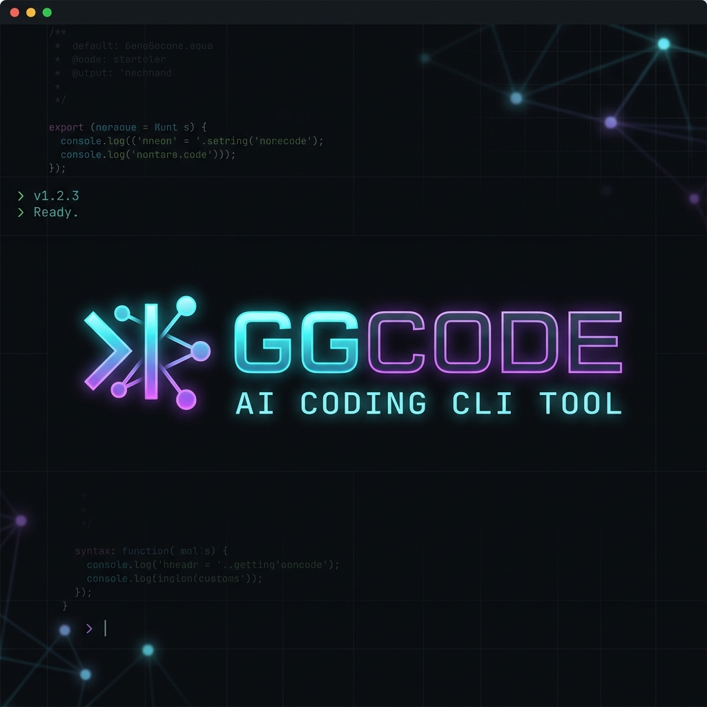

# ggcode

<p align="center">
  
</p>

**English** | **[中文](README_zh-CN.md)**

**ggcode** is an AI coding agent for the terminal. It can understand a codebase, edit files, run commands, manage checkpoints, use first-class LSP / MCP / skill workflows, and keep working inside a polished TUI instead of bouncing between scripts and browser tabs.

If you want a terminal-native coding workflow that feels like a product, not a demo, this is what ggcode is for.

## Why people use ggcode

- **Stay in the terminal** — chat, inspect code, edit files, review diffs, and manage sessions in one place
- **Work with real coding plans and endpoints** — OpenAI-compatible, Anthropic-compatible, Gemini, GitHub Copilot, and multiple coding-oriented vendor presets
- **Keep control when it matters** — supervised, plan, auto, bypass, and autopilot modes let you choose how much the agent can do
- **Clarify without derailing** — the TUI can surface structured multi-question ask_user flows when the agent is genuinely blocked
- **Recover quickly** — undo file changes with checkpoints instead of manually repairing bad edits
- **Scale up when needed** — use first-class LSP, MCP tools, skills, plugins, memory, background commands, and sub-agents
- **Fit daily usage** — bilingual UI, resumable sessions, queueing while the agent is busy, local shell mode, and shell-friendly install flows
- **Use inside your IDE** — ACP (Agent Client Protocol) support lets you run ggcode as an AI agent in JetBrains IDEs, Zed, and other ACP-compatible editors (see [docs/acp.md](docs/acp.md))

## Installation

### Homebrew (macOS / Linux)

```bash
brew tap topcheer/ggcode
brew install ggcode
```

### Go installer

```bash
go install github.com/topcheer/ggcode/cmd/ggcode-installer@latest
ggcode-installer
```

The installer downloads the matching GitHub Release binary into `GOBIN`, the first `GOPATH/bin`, or `~/go/bin`.

### npm

```bash
npm install -g @ggcode-cli/ggcode
```

The npm wrapper downloads the latest ggcode GitHub Release by default. Set `GGCODE_INSTALL_VERSION`
if you need to pin a specific release.

### pip

```bash
pip install ggcode
```

The Python wrapper also downloads the latest ggcode GitHub Release by default and respects
`GGCODE_INSTALL_VERSION` for explicit pinning.

### Release archives and installer packages

Each tagged release publishes desktop archives plus native installer/package files:

| Platform | Release asset | Install example |
| --- | --- | --- |
| macOS | `.pkg` | `sudo installer -pkg ./ggcode_<version>_darwin_universal.pkg -target /` |
| Windows | `.msi` | `msiexec /i .\ggcode_<version>_windows_x64.msi` |
| Debian / Ubuntu | `.deb` | `sudo dpkg -i ./ggcode_<version>_linux_<arch>.deb` |
| Fedora / RHEL / openSUSE | `.rpm` | `sudo rpm -i ./ggcode-<version>-1.<arch>.rpm` |
| Alpine | `.apk` | `sudo apk add --allow-untrusted ./ggcode-<version>-r1.<arch>.apk` |
| OpenWrt / opkg | `.ipk` | `opkg install ./ggcode_<version>_<arch>.ipk` |
| Arch Linux | `.pkg.tar.zst` | `sudo pacman -U ./ggcode-<version>-1-<arch>.pkg.tar.zst` |

Desktop releases also include archive assets (`.tar.gz` on Unix-like platforms and `.zip` on
Windows) if you prefer manual extraction over native installers.

If you prefer not to install from a package manager, the existing release archives, Go installer,
npm wrapper, and Python wrapper remain available.

### Build from source

```bash
git clone https://github.com/topcheer/ggcode.git
cd ggcode
go build -o ggcode ./cmd/ggcode
./ggcode
```

### Optional: install the local CI pre-commit hook

If you want local commits to catch the same Go issues that CI checks, install the bundled git hook:

```bash
make install-git-hooks
```

The hook will:

- auto-format staged Go files with `gofmt`
- run `go mod download`
- run `go build -o /tmp/ggcode ./cmd/ggcode`
- run `go vet ./...`
- run `go test -tags=!integration ./...`

The shared `make verify-ci` script also clears provider integration-test env vars, inherited
`GIT_*` hook context, and global git-hook config first, so local verification matches CI more
closely even when your machine has extra Git tooling installed.

You can also run the same check chain manually with:

```bash
make verify-ci
```

### Platform notes

- **macOS / Linux** command execution uses `sh`
- **Windows** command execution prefers **Git Bash** and falls back to **PowerShell**
- Shell completions are available for **bash**, **zsh**, **fish**, and **PowerShell**

## Quick start

### 1. Set up a model endpoint

The simplest path is still setting a normal vendor API key:

```bash
export ZAI_API_KEY="your-key"
# or OPENAI_API_KEY / ANTHROPIC_API_KEY / GEMINI_API_KEY / OPENROUTER_API_KEY / DASHSCOPE_API_KEY / ...
```

If you prefer GitHub Copilot, you can also sign in from the in-app **`/provider`** flow instead of
exporting an API key.

If you want Aliyun Bailian Coding Plan, use the built-in **`aliyun`** vendor with:

- `coding-openai` → `https://coding.dashscope.aliyuncs.com/v1`
- `coding-anthropic` → `https://coding.dashscope.aliyuncs.com/apps/anthropic`

The built-in OpenAI-compatible router presets also include:

- `aihubmix` → `https://aihubmix.com/v1` (`AIHUBMIX_API_KEY`)
- `getgoapi` → `https://api.getgoapi.com/v1` (`GETGOAPI_API_KEY`)
- `novita` → `https://api.novita.ai/openai/v1` (`NOVITA_API_KEY`)
- `poe` → `https://api.poe.com/v1` (`POE_API_KEY`)
- `requesty` → `https://router.requesty.ai/v1` (`REQUESTY_API_KEY`)
- `vercel` → `https://ai-gateway.vercel.sh/v1` (`VERCEL_AI_GATEWAY_API_KEY`)

If you use an **Anthropic-compatible endpoint**, ggcode can also bootstrap it on first launch from:

```bash
export ANTHROPIC_BASE_URL="https://your-endpoint"
export ANTHROPIC_AUTH_TOKEN="your-token"
```

### 2. Start ggcode

```bash
ggcode
```

On first launch, ggcode asks you to choose your preferred UI language.

### 3. Start with a real task

Examples:

```text
Explain how this project is structured
Refactor the auth middleware to use JWT
Add tests for the session store
Find why startup feels slow in the TUI
```

### 4. Use the built-in workflow features

- **`Ctrl+C`** cancels the active run
- If the agent is busy, you can keep typing — new prompts are **queued**
- Type **`$`** or **`!`** on an empty composer to enter **local shell mode**; press **`Esc`** to leave it when idle
- **`/undo`** reverts the last file edit
- **`/provider`** switches vendor / endpoint / model
- **`/mode`** changes how much autonomy the agent gets
- **`/status`** shows current runtime state and lets you install missing LSP servers in-place
- **`/mcp`** shows connected MCP servers and their tools
- **`/im`** opens the unified IM panel — manage all channel bindings, enable/disable adapters, and check status in one view
- **`/qq`**, **`/telegram`**, **`/discord`**, **`/slack`**, **`/feishu`**, **`/dingtalk`** open the platform-specific panel for pairing and binding
- **`/harness`** runs repo harness workflows like scaffold, checks, and cleanup
- When the agent truly cannot continue, it can open a **tabbed ask_user questionnaire** and resume from your batch answers

## What ggcode can do

From the product point of view, ggcode is more than “chat with a model”:

- **Code understanding** — read files, search the repo, inspect git status and diffs
- **Fast project browsing** — expand folders, filter by filename, and preview Markdown / source files without leaving the TUI
- **Semantic code navigation** — use first-class local LSP servers like `gopls`, `rust-analyzer`, `clangd`, `sourcekit-lsp`, `lua-language-server`, Python servers, and config-language servers for YAML / JSON / Dockerfile / shell files for hover, definition, references, symbols, workspace symbols, diagnostics, code actions, rename, and in-app installation from `/status`
- **Code changes** — create files, edit targeted regions, and checkpoint edits for undo
- **Command execution** — run foreground commands or long-running background jobs
- **Parallel help** — spawn sub-agents, inspect their progress, and poll long-running workers without blocking the main loop
- **Memory and context** — load project memory files like `GGCODE.md`, `AGENTS.md`, `CLAUDE.md`, and `COPILOT.md`
- **Extensibility** — connect MCP servers, custom plugins, and skills alongside the built-in LSP workflow
- **Remote IM surface** — bind the current workspace to IM channels (QQ, Telegram, Discord, Slack, DingTalk, Feishu, PC) so remote chats can mirror status and receive agent output with real-time streaming; user echo is suppressed on the originating channel to avoid duplicate messages; see [IM integration](#im-integration) below
- **Session continuity** — save, resume, export, and compact conversations; auto-compact uses intelligent truncation and LLM-powered summarization with session checkpoints for fast recovery
- **Harness workflows** — scaffold repo guidance, enforce invariants, track runs, and garbage-collect stale task state

## Modes: how much freedom the agent gets

| Mode | Best for | What it means |
| --- | --- | --- |
| `supervised` | Most users | Ask when a tool is not explicitly allowed or denied |
| `plan` | Safe exploration | Read-only style investigation; blocks writes and command execution |
| `auto` | Faster routine work | Automatically proceed on safer actions, stay cautious on risky ones |
| `bypass` | High-trust workflows | Allow almost everything, only stopping on critical operations |
| `autopilot` | Power users | Like bypass, but prefers safe best guesses and only asks via `ask_user` as a last resort when blocked |

## Slash commands you will actually use

### Core workflow

| Command | What it does |
| --- | --- |
| `/help` or `/?` | Show the in-app help |
| `/provider [vendor]` | Open the provider manager and switch vendor / endpoint / model, including GitHub Copilot login/logout flows |
| `/model <name>` | Switch model directly |
| `/mode <mode>` | Change permission mode |
| `/status` | Show current status, including local LSP availability, install hints, and in-place installation for supported languages |
| `/config` | View or update configuration |
| `/update` | Download the latest release and restart into the updated binary |
| `/lang <en|zh-CN>` | Change interface language |

### Session and recovery

| Command | What it does |
| --- | --- |
| `/sessions` | List saved sessions |
| `/resume <id>` | Resume a previous session |
| `/export <id>` | Export a session to Markdown |
| `/clear` | Clear the current conversation |
| `/compact` | Compress conversation history |

For environments where direct GitHub release downloads are unreliable, set
`GGCODE_UPDATE_BASE_URLS` to a comma-separated list of release sources for `/update`. Each entry can be
either a normal release base URL or a full-URL proxy prefix.
| `/undo` | Revert the last file edit |
| `/checkpoints` | List available edit checkpoints |

### Extended capabilities

| Command | What it does |
| --- | --- |
| `/mcp` | Inspect MCP servers and MCP tools |
| `/plugins` | List loaded plugins |
| `/skills` | Browse the skills the agent may invoke for you |
| `/memory` | Inspect stored memory |
| `/agents` | List active sub-agents |
| `/agent <id>` | Inspect a sub-agent |
| `/im` | Open the unified IM panel — manage all channels, enable/disable bindings, check adapter health |
| `/qq` | Open QQ-specific panel for pairing and bindings |
| `/telegram` or `/tg` | Open Telegram panel |
| `/discord` | Open Discord panel |
| `/slack` | Open Slack panel |
| `/feishu` or `/lark` | Open Feishu panel |
| `/dingtalk` or `/ding` | Open DingTalk panel |
| `/todo` | View or manage todo state |
| `/image` | Attach an image |
| `/bug` | Report a bug |
| `/init` | Generate `GGCODE.md` for the current project |
| `/harness` | Open the harness panel for `init/check/monitor/queue/tasks/run/run-queued/review/promote/release/gc/doctor`; `queue` and `run` use the current input draft, and typed `/harness ...` commands still work |
| `/exit`, `/quit` | Exit ggcode |

## Non-interactive and scripted usage

ggcode also supports a simple pipe-mode workflow when you do not want to open the TUI:

```bash
ggcode \
  --prompt "Summarize the changes in this repository" \
  --allowedTools read_file \
  --output summary.md
```

For harness-engineering style repos, ggcode also exposes a tracked control plane:

```bash
ggcode harness init --goal "Build an ERP system"
ggcode harness check
ggcode harness queue "Implement purchasing workflow"
ggcode harness queue --context internal-inventory "Implement inventory workflow"
ggcode harness queue --depends-on <purchasing-task-id> "Implement inventory workflow"
ggcode harness tasks
ggcode harness monitor
ggcode harness monitor --watch --interval 2s
ggcode harness contexts
ggcode harness inbox
ggcode harness inbox promote --owner inventory-team
ggcode harness inbox retry --owner unowned
ggcode harness run --all-queued
ggcode harness run --all-queued --retry-failed
ggcode harness run --resume-interrupted --retry-failed
ggcode harness review
ggcode harness review approve <task-id>
ggcode harness review reject <task-id> --note "needs boundary cleanup"
ggcode harness promote
ggcode harness promote apply <task-id>
ggcode harness promote apply --all-approved
ggcode harness release
ggcode harness release --owner inventory-team
ggcode harness release --context internal/inventory
ggcode harness release --environment staging
ggcode harness release --group-by owner
ggcode harness release apply --note "staging wave"
ggcode harness release apply --group-by context --batch-id release-erp
ggcode harness release rollouts --environment prod
ggcode harness release rollouts
ggcode harness release advance rollout-erp
ggcode harness release approve rollout-erp --wave 2 --note "change board approved"
ggcode harness release reject rollout-erp --wave 2 --note "waiting for policy review"
ggcode harness release pause rollout-erp --note "waiting for signoff"
ggcode harness release resume rollout-erp --note "signoff received"
ggcode harness release abort rollout-erp --note "freeze window"
ggcode harness doctor
ggcode harness gc
```

### Harness workflow: from scaffold to rollout

Harness is the repo-scale control plane in ggcode. It is designed for work that is too large or too stateful for a single chat turn, but still wants to reuse the same agent, tools, and approval model.

1. **Initialize the project surface**
   - `ggcode harness init` bootstraps git automatically when the directory is still empty or non-git
   - it creates `.ggcode/harness.yaml`, root guidance files, and the monitor state files `.ggcode/harness/events.jsonl` plus `.ggcode/harness/snapshot.db`
   - in larger repos it also detects obvious bounded contexts such as `cmd/` and `internal/*`, then writes nested `AGENTS.md` files so local guidance can live near the code it governs

2. **Queue and execute tracked work**
   - `ggcode harness queue` creates persistent backlog items instead of immediately starting a one-off run
   - tasks can be scoped with `--context` and dependency-gated with `--depends-on`, so downstream work stays `blocked` until prerequisites complete
   - queued execution is **worker-backed by default** and normally runs inside isolated worktrees under `.ggcode/harness/worktrees/<task-id>`, which keeps repo-root state cleaner during long efforts
   - if the repo root has real uncommitted or untracked project files, `harness run` now asks once whether ggcode should first create a **checkpoint commit** in the main workspace before creating task worktrees; declining the prompt cancels the run instead of silently forking from a stale base
   - `run.max_attempts` in `.ggcode/harness.yaml`, `ggcode harness run --retry-failed`, and `ggcode harness run --resume-interrupted` cover bounded retries and interrupted-session recovery

3. **Inspect and route operational state**
   - `ggcode harness monitor` shows the live task/release/rollout snapshot and supports `--watch`
   - `ggcode harness contexts` summarizes backlog state per bounded context, including verification failures and release readiness
   - contexts can carry lightweight owner metadata, and `ggcode harness inbox` turns that into actionable owner-grouped buckets for review-ready, promotion-ready, and retryable work
   - `ggcode harness doctor` and `ggcode harness gc` handle entropy signals such as stale blocked tasks, orphaned worktrees, and worker/task drift

4. **Promote verified work toward release**
   - completed tasks persist delivery evidence such as changed files and a delivery report, then enter the **review loop**
   - `ggcode harness review` approves or rejects verified tasks; rejected items re-enter the retry path with notes
   - approved work enters the **promotion loop** through `ggcode harness promote`, which can also merge git-worktree task branches back into the repo root when applied
   - promoted work then enters the **release loop** through `ggcode harness release` and `ggcode harness release apply`, with optional `--owner`, `--context`, `--environment`, and `--group-by owner|context`
   - grouped releases become staged rollout waves managed by `harness release rollouts`, `approve`, `reject`, `advance`, `pause`, `resume`, and `abort`

Rollout and gate state is visible outside the release commands too: `harness doctor`, `harness contexts`, and `harness inbox` all surface rollout activity and gate counts (`pending`, `approved`, `rejected`) so operators can monitor progress without bouncing between narrow subcommands.

Useful flags:

- `--prompt` / `-p` — run a non-interactive prompt
- `--allowedTools` — restrict which tools are allowed in pipe mode
- `--output` — write the answer to a file instead of stdout
- `--bypass` — start in bypass mode
- `--resume <id>` — resume a previous session immediately
- `--config <path>` — use a specific config file

## IM integration

ggcode can connect to chat platforms so you can interact with the agent from your phone, another machine, or a shared team channel. Supported platforms:

| Platform | Command | Transport |
| --- | --- | --- |
| QQ | `/qq` | WebSocket (QQ bot gateway) |
| Telegram | `/telegram` or `/tg` | Long-polling or webhook |
| Discord | `/discord` | Discord Gateway |
| Feishu / Lark | `/feishu` or `/lark` | Feishu WebSocket |
| DingTalk | `/dingtalk` or `/ding` | DingTalk Stream mode |
| Slack | `/slack` | Socket Mode |
| PC | `/pc` | PC relay |

### Quick setup

1. **Configure an adapter** in `ggcode.yaml` under `im.adapters` (see `ggcode.example.yaml` for full examples):

```yaml
im:
  enabled: true
  adapters:
    telegram:
      enabled: true
      platform: telegram
      extra:
        bot_token: ${TELEGRAM_BOT_TOKEN}
```

2. **Start ggcode** — adapters connect automatically on startup.

3. **Bind a channel** — use `/im` in the TUI to see all adapters and bind/unbind channels, or use the platform-specific command (e.g. `/telegram`) to pair.

### Features

- **Real-time streaming** — agent output is delivered live to IM channels as it is generated
- **Remote commands** — send `/provider`, `/model`, `/mode` and other commands from the chat
- **Ask-user forwarding** — when the agent needs clarification, the question appears in the chat and your reply feeds back to the agent
- **Echo suppression** — messages you send from the originating channel are not mirrored back, avoiding duplicate noise
- **Per-channel binding** — bind multiple channels to the same workspace; each channel sees agent output independently
- **Voice messages** — optional STT integration transcribes voice messages into text prompts (configure `im.stt`)
- **Enable/disable channels** — use `/im` to temporarily disable a binding without removing it

### Unified IM panel (`/im`)

Type `/im` in the TUI to open the unified IM panel. From there you can:

- View all active and disabled channel bindings across all platforms
- **Disable** a channel (press `d`) — pauses agent output to that channel
- **Enable** a previously disabled channel (press `e`)
- Navigate with `j`/`k` or arrow keys; press `Esc` to close

## Configuration

Most users only need a small config file:

```yaml
vendor: zai
endpoint: cn-coding-openai
model: glm-5-turbo
language: en
default_mode: supervised

allowed_dirs:
  - .

tool_permissions:
  read_file: allow
  search_files: allow
  run_command: ask
  write_file: ask
```

ggcode ships with built-in presets for mainstream vendors and several coding-oriented endpoints,
including Aliyun Bailian Coding Plan, so you usually start by choosing a vendor or setting API keys
rather than writing the full provider catalog yourself.

Recent built-in router-style presets include **AIHubMix**, **GetGoAPI**, **Novita AI**, **Poe**,
**Requesty**, and **Vercel AI Gateway**. In the TUI `/provider` panel, ggcode also shows the
expected API key env var for the currently selected vendor/endpoint so you can configure it without
guessing.

For long-running or interactive shell work, the built-in async command tools let the agent start a background command, poll progress, send follow-up stdin input, and stop the job without blocking the whole session.

Skills are documented and browsable through `/skills`, but they are not a user slash-command surface. They are primarily part of the agent's reusable capability inventory and are invoked by the model through the `skill` tool when appropriate.

Bundled skills now cover several high-value operational workflows out of the box, including **debugging**, **verification**, **ggcode config edits**, and **browser automation guidance through MCP**.

For the complete reference, examples, vendor catalog, hooks, MCP servers, plugins, and sub-agent settings, see:

- [`ggcode.example.yaml`](ggcode.example.yaml)

## MCP, plugins, hooks, and memory

### MCP servers

Use MCP when you want ggcode to access external tool ecosystems.

```yaml
mcp_servers:
  - name: filesystem
    command: npx
    args:
      - -y
      - "@anthropic/mcp-filesystem"
      - /path/to/allowed/dir
```

ggcode discovers MCP tools automatically and makes them available in the agent loop.

#### MCP OAuth 2.1

HTTP-type MCP servers that require authentication are supported through the standard MCP OAuth 2.1 flow. When an MCP server returns a `401 Unauthorized`, ggcode automatically:

1. Discovers the OAuth authorization server metadata
2. Registers a client via Dynamic Client Registration (or uses a built-in / configured client ID)
3. Opens a browser for the device-flow authorization
4. Stores and refreshes access tokens in `~/.ggcode/provider_auth.json`

For servers that do not support Dynamic Client Registration, you can configure a client ID:

```yaml
mcp_servers:
  - name: github
    type: http
    url: https://api.githubcopilot.com/mcp/
    oauth_client_id: "Iv1.xxxxxxxxxxxx"
```

Built-in client IDs are provided for common servers (e.g., GitHub MCP).

If you want browser automation, connect a browser-oriented MCP server first. Once connected, its tools appear in `/mcp`, and any prompt-backed browser workflows also show up in `/skills`. ggcode does **not** pretend to have built-in browser control when no browser MCP server is configured.

The built-in quick-start path is the Playwright preset from the `/mcp` panel (`b`), which installs:

```yaml
mcp_servers:
  - name: playwright
    type: stdio
    command: npx
    args:
      - -y
      - "@playwright/mcp"
```

### Plugins and skills

- **Plugins** add custom tools from config
- **Skills** add higher-level capabilities and workflows
- **`/skills`** is the easiest place to see what is currently available, including MCP prompt-backed skills once those servers are connected
- Bundled skills include operational helpers such as `debug`, `verify`, `update-config`, and `browser-automation`

### Project memory

ggcode can load project guidance from files such as:

- `GGCODE.md`
- `AGENTS.md`
- `CLAUDE.md`
- `COPILOT.md`

Use these files to tell ggcode how your project works, what conventions to follow, and what to avoid.

## Shell completions

```bash
# Bash
ggcode completion bash > /etc/bash_completion.d/ggcode

# Zsh
ggcode completion zsh > "${fpath[1]}/_ggcode"

# Fish
ggcode completion fish > ~/.config/fish/completions/ggcode.fish

# PowerShell
ggcode completion powershell | Out-String | Invoke-Expression
```

## More documentation

- **Want to use the product?** Start here in the README
- **Want the full config surface?** See [`ggcode.example.yaml`](ggcode.example.yaml)
- **Want implementation details?** See [`docs/ARCHITECTURE.md`](docs/ARCHITECTURE.md)

## License

MIT
