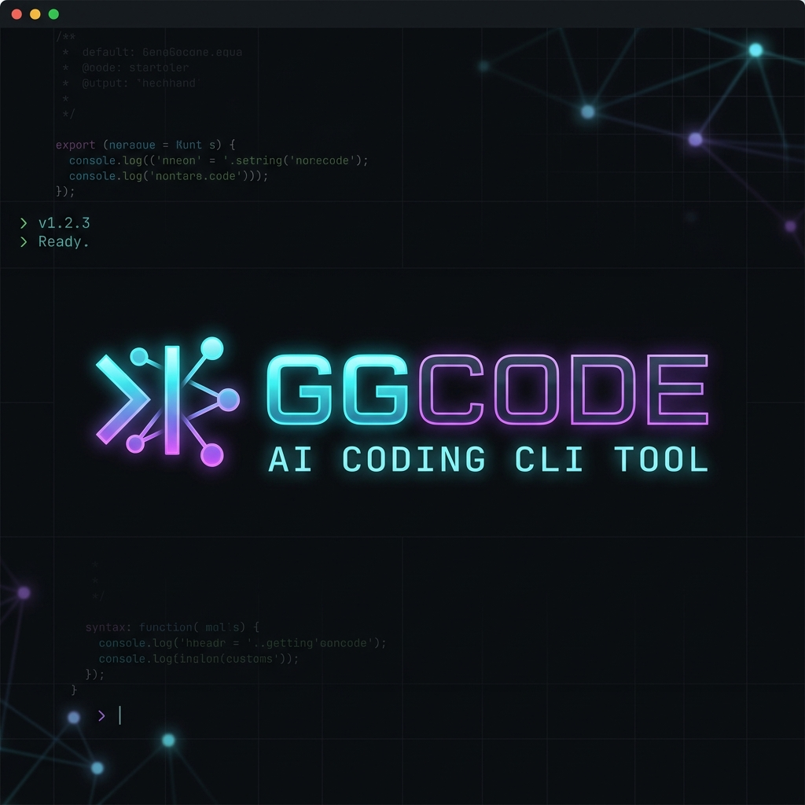

# ggcode

<p align="center">
  
</p>

**English** | **[中文](README_zh-CN.md)**

An AI coding agent for the terminal. Understands your codebase, edits files, runs commands, and ships code — with a polished TUI, resumable sessions, and multi-agent support.

---

## Install

**macOS / Linux:**
```bash
curl -fsSL https://ggcode.dev/install.sh | bash
```

**Windows:**
```powershell
irm https://ggcode.dev/install.ps1 | iex
```

**Other methods:** [Homebrew](docs/guide/install.md#macos) · [winget](docs/guide/install.md#windows) · [npm](docs/guide/install.md#npm) · [pip](docs/guide/install.md#pip) · [build from source](docs/guide/install.md#build-from-source)

> All install scripts default to non-privileged (no sudo / admin required).

## Quick Start

```bash
# 1. Run ggcode in your project
cd your-project
ggcode

# 2. On first launch, configure your API key (interactive prompt)
#    Or set it directly:
#    Or set up via the interactive wizard on first launch

# 3. Start coding — just type your request
```

New to ggcode? Read the **[Getting Started guide](docs/guide/getting-started.md)**.

---

## LAN Chat — Real-Time Team Collaboration

<p align="center">
  <strong>Zero-config P2P messaging between ggcode instances on your LAN</strong>
</p>

Every ggcode instance automatically discovers other instances on the same
local network via mDNS — no relay server, no accounts, no configuration.

| Feature | Description |
|---------|-------------|
| **Auto-discovery** | mDNS finds peers automatically — zero config |
| **DM & broadcast** | Message individuals, teams, or everyone on the LAN |
| **Agent-to-agent** | Route messages to `@agent` for cross-instance delegation |
| **Presence** | See who's online, their project, role, team, and languages |
| **File sharing** | Drag-and-drop attachments up to 10 MB |
| **Read receipts** | Track message delivery and read status |
| **Cross-platform** | Works in TUI, Desktop GUI, and daemon mode |
| **Privacy** | Messages stay on your LAN — nothing goes through external servers |

Quick example — your agent can collaborate with peers:
```
You: "ask the platform team to review my PR"
Agent: lanchat(action='send_team', team='platform', message='Can you review PR #123?')
```

The built-in community key ensures interoperability regardless of
individual A2A auth configuration.

📖 **[Full LAN Chat Guide →](docs/guide/lan-chat.md)**

---

## Features

- **Codebase-aware** — reads, understands, and edits your entire project
- **Full dev toolkit** — file edits, shell commands, Git, LSP, search
- **Semantic code search** — BM25-based `code_search` finds conceptually related code, not just keyword matches
- **Code health analysis** — cyclomatic complexity, function length, nesting depth metrics via `code_health`
- **Tech-debt scanner** — `scan_todos` surfaces TODO/FIXME/HACK markers with severity ranking and git-blame staleness
- **Browser automation** — Go-native CDP for SPA/JS testing without Node.js or Playwright
- **Screenshot capture** — full screen, window, or region screenshots for visual debugging
- **Clipboard integration** — read from and write to the system clipboard
- **Editor launcher** — `open_editor` opens files in the user's IDE (VS Code, Cursor, JetBrains, Vim, etc.) at a specific line/column, auto-detected from env vars
- **Agent-accessible undo** — `undo_edit` lets the LLM revert its own file edits via checkpoints, avoiding error-prone fix-forward when a previous change was wrong
- **Schema-constrained tool validation** — pre-execution pipeline that validates enum values, numeric bounds (min/max), string length constraints, and strips hallucinated parameters — saving wasted iterations on weak models
- **Adaptive tool timeout** — per-tool category-based timeout that adapts to observed latency, replacing a flat 5-minute default with sensible bounds (30–180s per category) so hung tools fail fast instead of wasting minutes
- **PTC (Programmatic Tool Calling)** — the agent writes JavaScript in a sandboxed VM to batch-call read-only tools (read_file, grep, git_log, web_search, etc.) in a single round-trip, dramatically reducing context window consumption for multi-step analysis
- **MCP integration** — connect external tools and data sources, with dynamic tool refresh, server logging, full capability detection, and MCP sampling (servers can request LLM completions)
- **gRPC plugins** — extend ggcode with custom tools in Go, Python, Node.js, or any language
- **Multi-agent** — spawn parallel workers, delegate to teammates, A2A protocol
- **Multi-provider** — OpenAI, Anthropic, Gemini, DeepSeek, Kimi, Copilot, and more; configurable reasoning effort and tool choice across all protocols
- **[LAN Chat](docs/guide/lan-chat.md)** — zero-config P2P real-time messaging between instances on your LAN
- **Editor integration** — JetBrains, Zed, and ACP-compatible editors via ACP
- **WebUI** — built-in web interface accessible from any browser
- **IM integration** — control from QQ, Telegram, Discord, Slack, Feishu, DingTalk
- **Harness workflow** — isolated task execution with review and promotion
- **Scheduled tasks** — cron jobs, reminders, and background automation
- **Resumable sessions** — pause and resume any conversation
- **Desktop + Mobile** — native apps for macOS, Windows, Linux, iOS, Android

## Platforms

| Platform | Install |
|----------|---------|
| **CLI** (macOS/Linux/Windows) | This repo — the primary interface |
| **[Desktop](docs/guide/desktop.md)** | Native app for macOS, Windows, Linux |
| **[Mobile](docs/guide/mobile.md)** | [iOS (App Store)](https://apps.apple.com/us/app/ggcode-mobile/id6770855612) and [Android (Google Play)](https://play.google.com/store/apps/details?id=gg.ai.ggcode.mobile) |

## Documentation

| Guide | Description |
|-------|-------------|
| [Getting Started](docs/guide/getting-started.md) | First steps, API key setup, basic usage |
| [Installation](docs/guide/install.md) | All install methods for every platform |
| [CLI Reference](docs/guide/cli-reference.md) | Commands, flags, pipe mode |
| [Providers](docs/guide/providers.md) | LLM vendor and endpoint configuration |
| [Slash Commands](docs/guide/slash-commands.md) | In-TUI command reference |
| [Permission Modes](docs/guide/modes.md) | Supervised, plan, auto, bypass, autopilot |
| [MCP Servers](docs/guide/mcp.md) | Connect external tools via MCP |
| [gRPC Plugins](docs/guide/grpc-plugins.md) | Build and install custom tool plugins (Go, Python, Node.js) |
| [IM Integration](docs/guide/im-integration.md) | QQ, Telegram, Discord, Slack, Feishu, DingTalk |
| [Harness](docs/guide/harness.md) | Isolated task workflow with review |
| [A2A Protocol](docs/guide/a2a.md) | Cross-instance agent delegation |
| [ACP / Editor](docs/guide/acp.md) | JetBrains, Zed, and ACP-compatible editors |
| [Delegation](docs/guide/delegation.md) | Delegate tasks to Copilot, Claude, Cursor, and other agents |
| [Multi-Agent](docs/guide/multi-agent-modes.md) | Sub-agents, teammates, and team coordination |
| [LAN Chat](docs/guide/lan-chat.md) | Real-time messaging between instances on your LAN |
| [Configuration](docs/guide/configuration.md) | Full config file reference |
| [Adaptive Timeout](docs/design/adaptive-timeout.md) | Per-tool category-based timeout design |
| [Project Memory](docs/guide/project-memory.md) | GGCODE.md, AGENTS.md, CLAUDE.md + .cursorrules, .windsurfrules, .clinerules compat |
| [Skills](docs/guide/skills.md) | Reusable workflow patterns |
| [Shell Completion](docs/guide/shell-completion.md) | bash, zsh, fish, powershell |

## Quick Links

- **[Download Desktop App](https://ggcode.dev)** · **[Releases](https://github.com/topcheer/ggcode/releases)**
- **[Report a Bug](https://github.com/topcheer/ggcode/issues)** · **[Request a Feature](https://github.com/topcheer/ggcode/issues)**

## License

MIT
