# Mermaid 渲染测试

本文档包含各种 Mermaid 图表，用于测试桌面版 Markdown 渲染能力。

---

## 1. Flowchart（流程图）

### 1.1 基本流程图

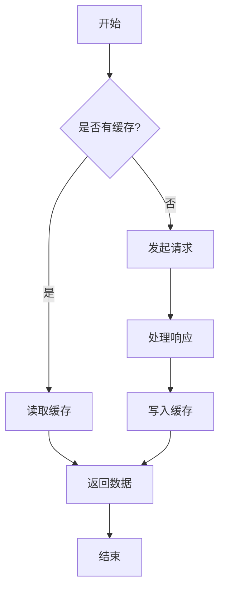

### 1.2 复杂流程图（多分支 + 子图）

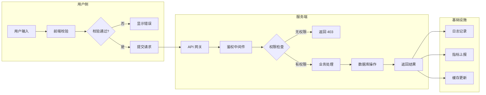

### 1.3 横向流程图

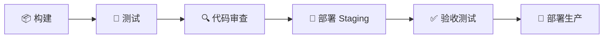

---

## 2. Sequence Diagram（时序图）

### 2.1 用户登录时序图

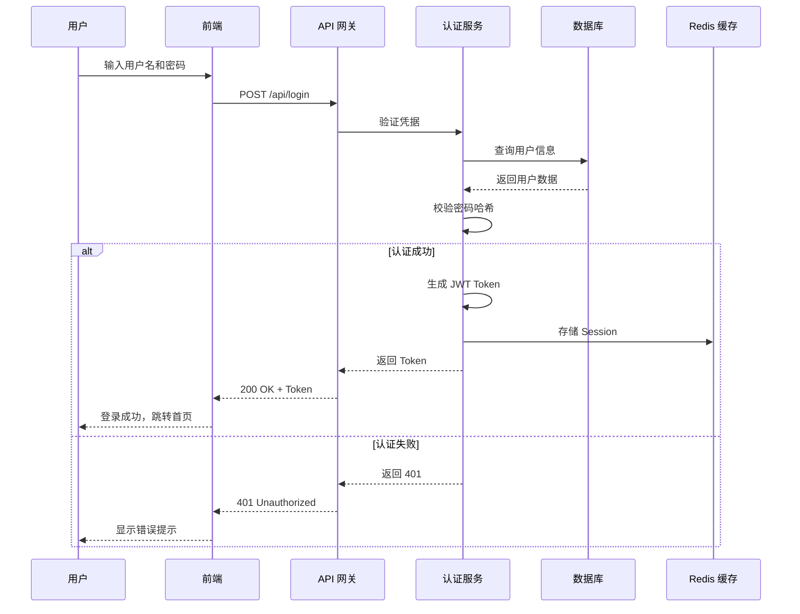

### 2.2 微服务通信时序图

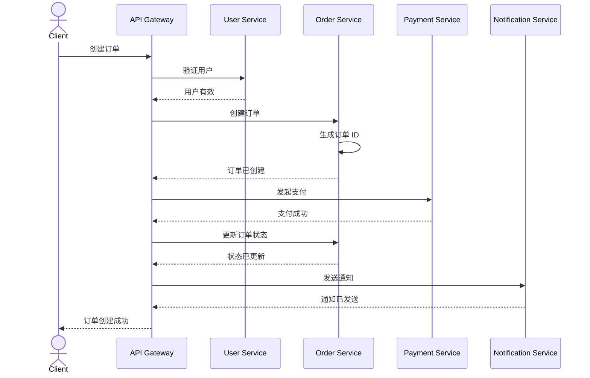

---

## 3. Class Diagram（类图）

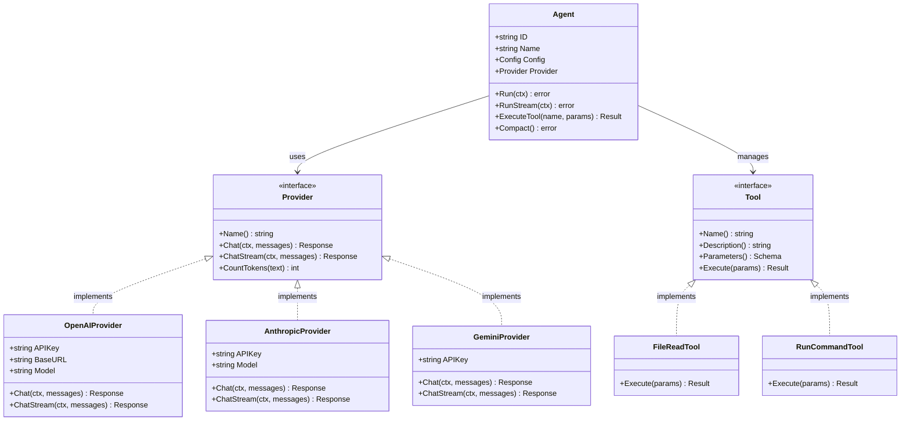

---

## 4. State Diagram（状态图）

### 4.1 订单状态流转

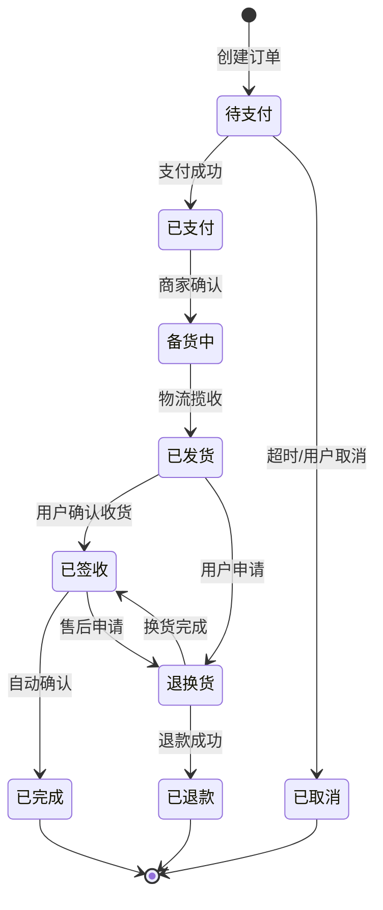

### 4.2 Agent 运行状态

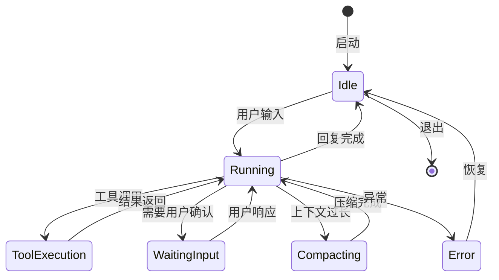

---

## 5. ER Diagram（实体关系图）

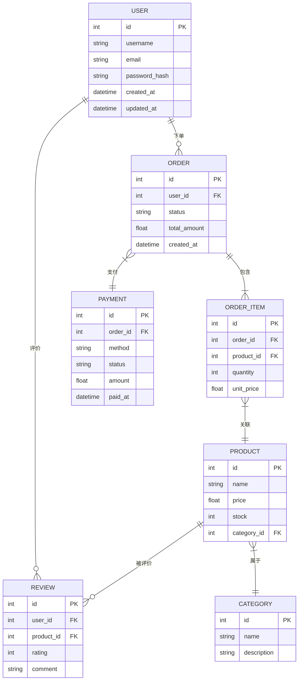

---

## 6. Gantt Chart（甘特图）

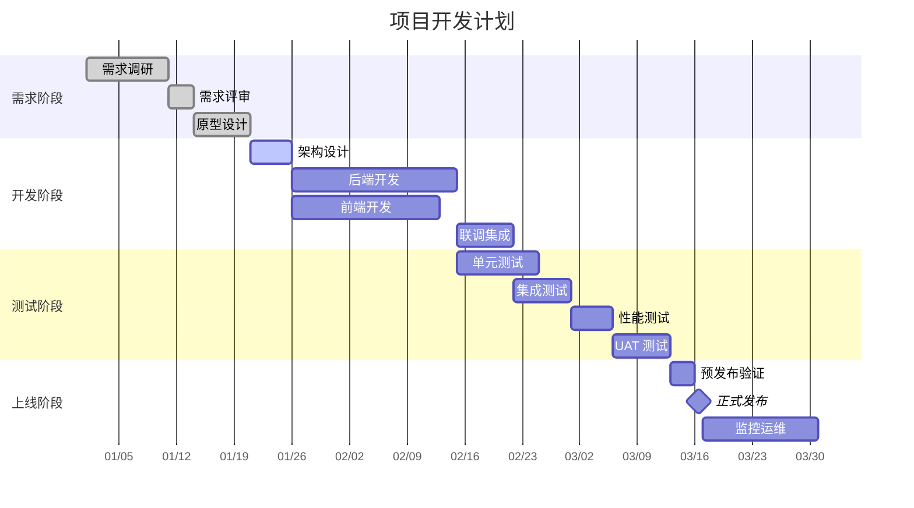

---

## 7. Pie Chart（饼图）

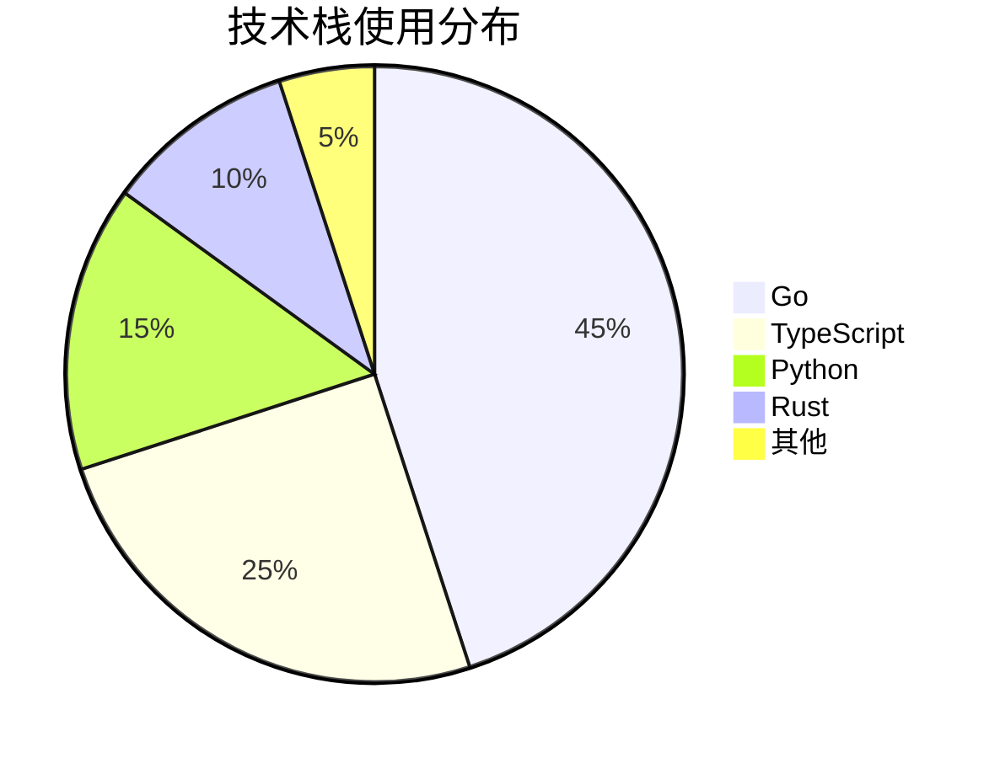

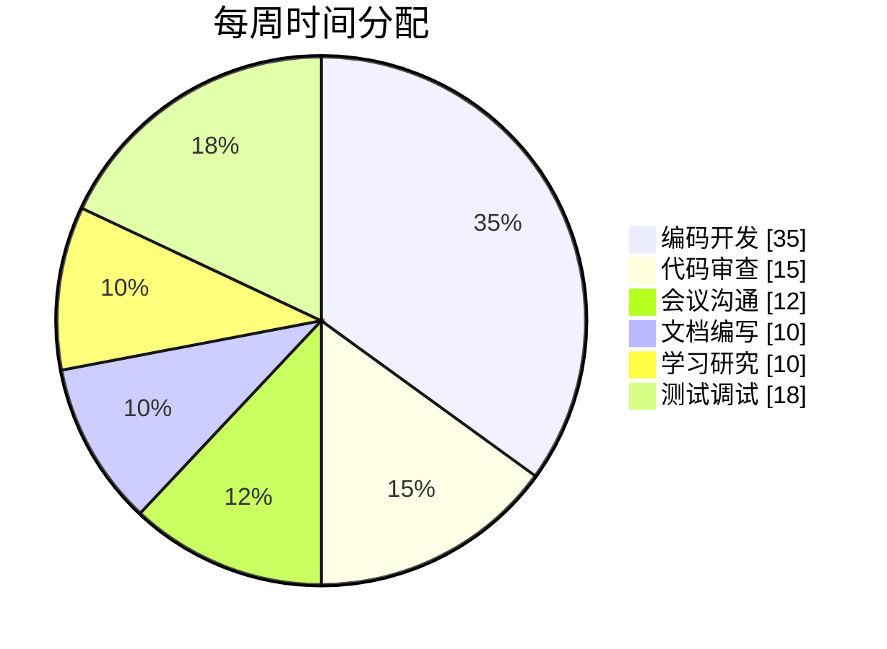

---

## 8. Mindmap（思维导图）

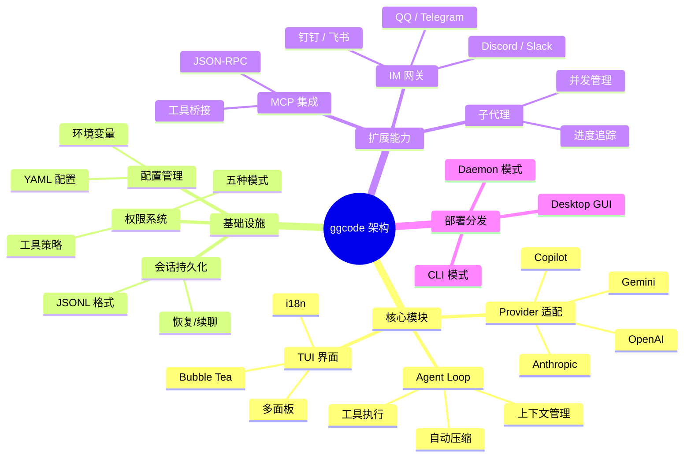

---

## 9. Timeline（时间线）

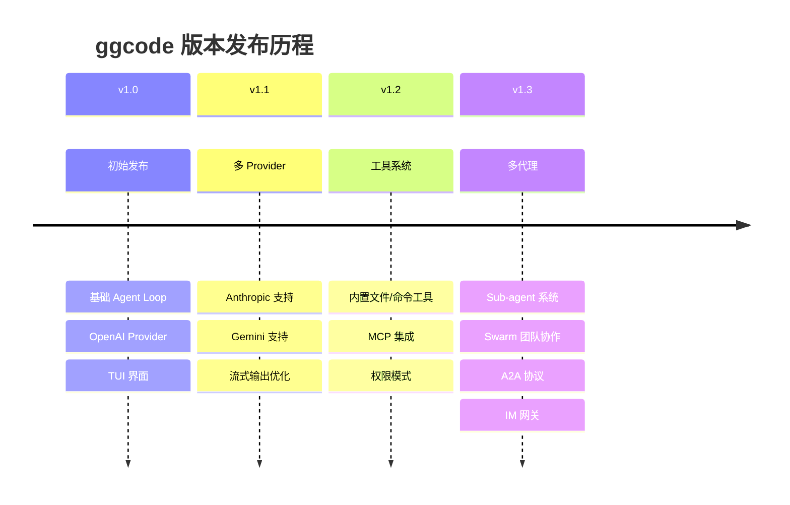

---

## 10. Gitgraph（Git 图）

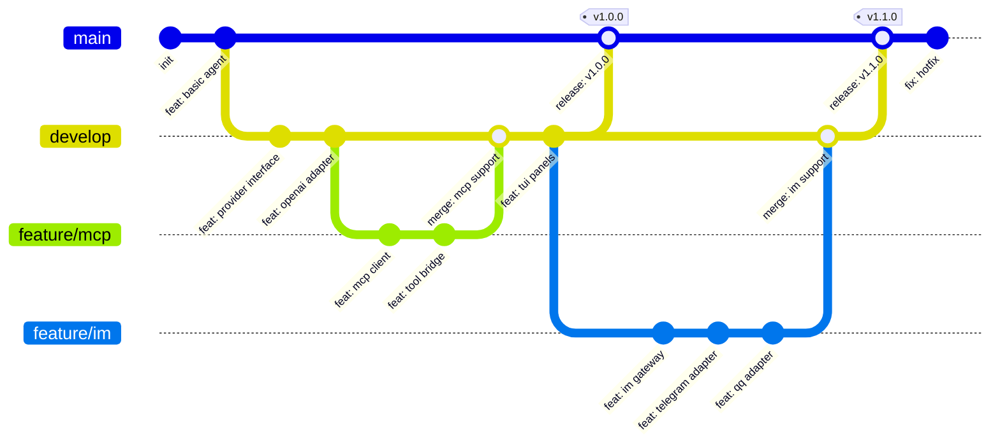

---

## 11. Sankey Diagram（桑基图）

```mermaid
---
config:
  sankey:
    showValues: false
---
sankey-beta

用户输入,Agent Loop,30
Agent Loop,LLM 调用,25
Agent Loop,工具执行,15
LLM 调用,OpenAI,10
LLM 调用,Anthropic,8
LLM 调用,Gemini,7
工具执行,文件操作,8
工具执行,命令执行,5
工具执行,Web 工具,4
工具执行,MCP 工具,3
文件操作,读写文件,5
文件操作,搜索文件,3
命令执行,Shell,5
Web 工具,搜索,2
Web 工具,抓取,2
```

---

## 12. XYChart（折线/柱状图）

```mermaid
xychart-beta
    title "月度活跃用户增长趋势"
    x-axis [1月, 2月, 3月, 4月, 5月, 6月, 7月, 8月, 9月, 10月, 11月, 12月]
    y-axis "用户数（千）" 0 --> 100
    line [12, 18, 25, 32, 38, 45, 52, 61, 70, 78, 85, 95]
```

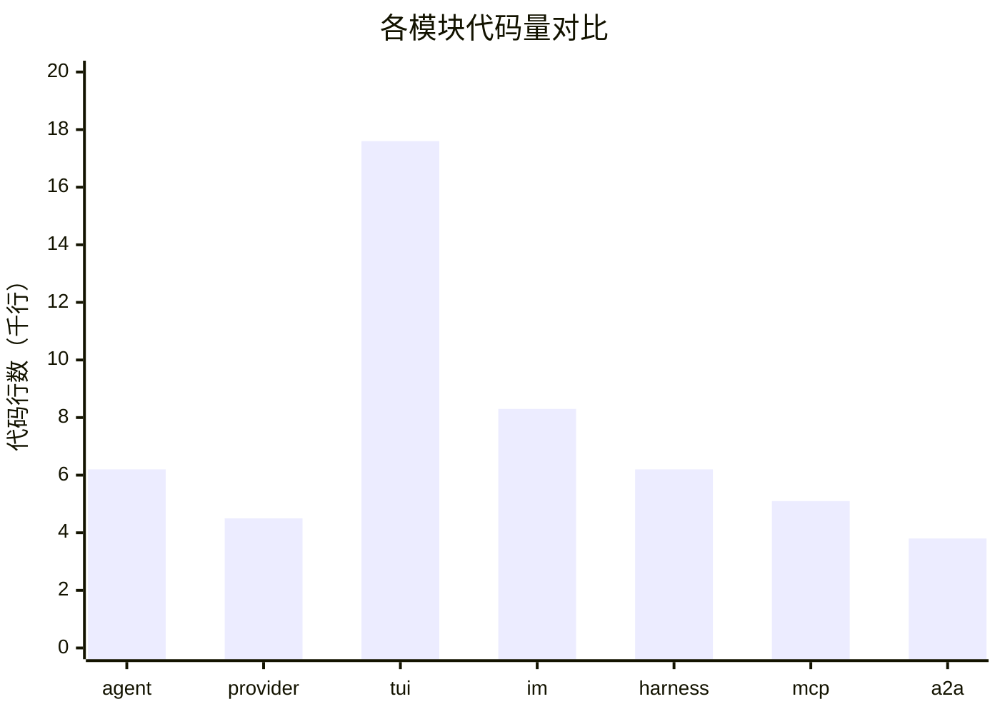

---

## 13. Block Diagram（方块图）

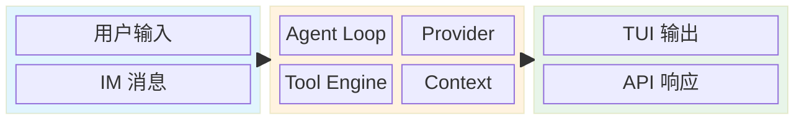

---

## 14. Quadrant Chart（象限图）

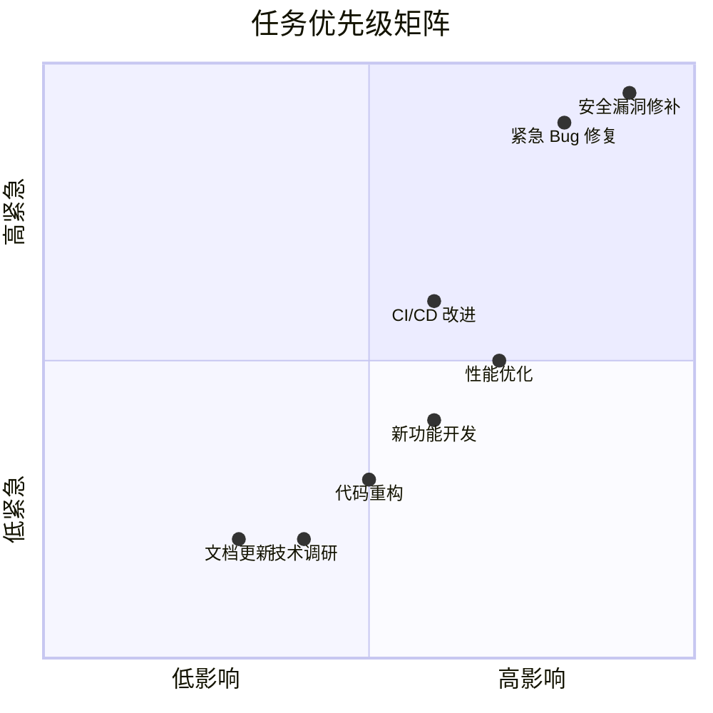

---

## 15. Requirement Diagram（需求图）

```mermaid
requirementDiagram
    requirement user_auth {
        id: REQ-001
        text: 系统应支持用户认证
        risk: high
        verifymethod: test
    }

    requirement oauth_support {
        id: REQ-002
        text: 支持 OAuth2 登录
        risk: medium
        verifymethod: test
    }

    requirement jwt_token {
        id: REQ-003
        text: 使用 JWT 进行会话管理
        risk: medium
        verifymethod: inspection
    }

    functionalRequirement api_auth {
        id: REQ-004
        text: API 端点需要认证
    }

    performanceRequirement token_perf {
        id: REQ-005
        text: Token 验证延迟 < 10ms
    }

    user_auth - derives -> oauth_support
    user_auth - derives -> jwt_token
    jwt_token - refines -> api_auth
    jwt_token - traces -> token_perf
```

---

## 16. Journey Map（用户旅程图）

```mermaid
journey
    title 新用户首次使用体验
    section 安装
        下载安装包: 5: 用户
        运行安装程序: 4: 用户
        首次启动: 4: 用户
    section 配置
        选择 Provider: 3: 用户
        输入 API Key: 3: 用户
        配置 MCP 服务器: 2: 用户
    section 使用
        第一次对话: 5: 用户, 系统
        使用工具: 4: 用户, 系统
        查看代码变更: 4: 用户
    section 满意
        完成首个任务: 5: 用户
        推荐给同事: 5: 用户
```

---

## 17. C4 Diagram（C4 架构图）

```mermaid
C4Context
    title 系统上下文图 - ggcode 平台

    Person(user, "开发者", "使用 ggcode 的软件工程师")
    Person(admin, "管理员", "系统运维人员")

    System(ggcode, "ggcode", "AI 编程助手 Agent")

    System_Ext(llm, "LLM Provider", "OpenAI / Anthropic / Gemini")
    System_Ext(github, "GitHub", "代码托管平台")
    System_Ext(im, "IM 平台", "Telegram / Discord / Slack")

    Rel(user, ggcode, "使用 CLI / TUI / Desktop")
    Rel(admin, ggcode, "配置管理")
    Rel(ggcode, llm, "API 调用")
    Rel(ggcode, github, "代码操作")
    Rel(ggcode, im, "消息推送")
```

---

## 渲染测试说明

本文档包含以下 Mermaid 图表类型：

| 序号 | 图表类型 | 说明 |
|------|---------|------|
| 1 | Flowchart | 流程图（含子图、多分支） |
| 2 | Sequence | 时序图（含 alt 分支） |
| 3 | Class | 类图（继承、实现关系） |
| 4 | State | 状态图（含复合状态） |
| 5 | ER | 实体关系图 |
| 6 | Gantt | 甘特图（项目计划） |
| 7 | Pie | 饼图 |
| 8 | Mindmap | 思维导图 |
| 9 | Timeline | 时间线 |
| 10 | Gitgraph | Git 分支图 |
| 11 | Sankey | 桑基图（Beta） |
| 12 | XYChart | 折线图/柱状图（Beta） |
| 13 | Block | 方块图（Beta） |
| 14 | Quadrant | 象限图 |
| 15 | Requirement | 需求图 |
| 16 | Journey | 用户旅程图 |
| 17 | C4 | C4 架构图 |

> ✅ 如果所有图表都能正确渲染，说明桌面版 Markdown 渲染器支持完整的 Mermaid 语法。
